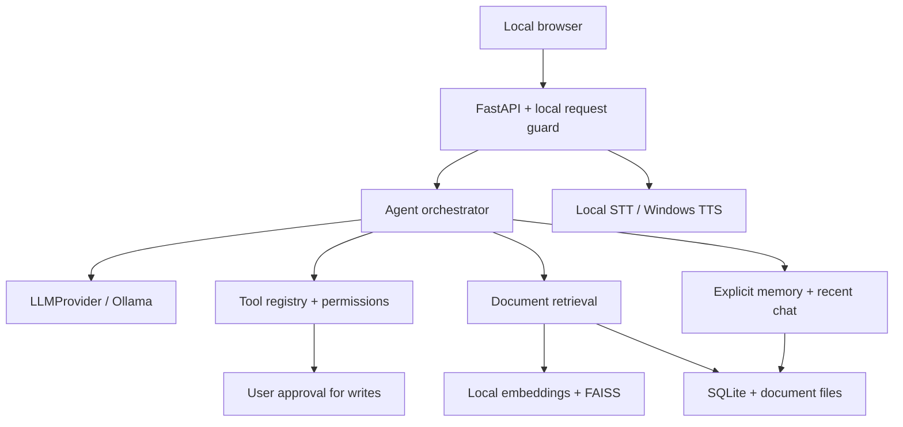

# Architecture

The browser and API share a loopback origin. The server persists local data, invokes local models, and applies permissions. Browser buttons use real API endpoints; runtime code contains no fake model responses.

## Layout

| Path | Responsibility |
|---|---|
| `app/main.py` | Lifecycle, local-only request guard, static UI and error boundaries. |
| `app/api/routes.py` | Validated API, CRUD, generation lifecycle, upload/index, approvals, audio and rendering. |
| `app/core/` | Configuration, path guards, permission levels and safe Markdown rendering. |
| `app/llm/` | Abstract provider and Ollama HTTP integration/model health. |
| `app/agent/` | Intent/activity labels, instructions and bounded streaming/tool loop. |
| `app/database/` | SQLite initialization/version and transaction helpers. |
| `app/memory/` | Explicit preferences and recent conversation context. |
| `app/rag/` | Extractors, chunks, embedding/index/retrieval pipeline. |
| `app/tools/` | Registry, arithmetic, approved-filesystem reads, system and data analysis. |
| `app/vision/` | Image validation before model calls. |
| `app/voice/` | Local STT, Windows speech adapter, wake-word extension point. |
| `frontend/` | No-build browser UI, local stylesheet and client-side API workflows. |
| `scripts/` | Windows setup/start/speech, optional voice-model download, Linux development launch. |
| `tests/` | Isolated API/security/protocol tests and optional live-browser smoke script. |

A normal turn records the user message, gathers explicit preferences and bounded history, optionally retrieves selected documents, then calls the model. If native tool calls are supported, validated safe calls run and return observations to the model for another turn. Note/task writes become stored proposals requiring a separate user approval. Output streams as newline-delimited JSON events. A stopped turn saves partial assistant output with its status.

Conversation locks and stop signals are process-local: run one server worker. Repeated writes, multi-user sessions, distributed workers and background durable agent jobs are not supported in this release. FAISS indexes are rebuilt from SQLite vectors; a larger knowledge base should move to maintained persistent indexes and batched retrieval.

Model-generated content, document text and tool observations are untrusted. Prompt instructions reduce injection risk but cannot guarantee model behavior. Security-critical decisions are enforced in code: no shell, no arbitrary Python, path validation, schema validation, bounded loops and approval-gated writes.
